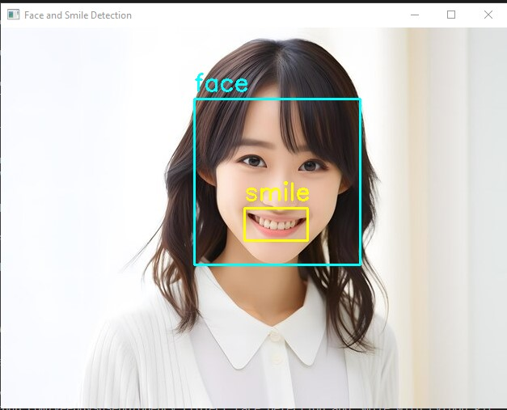

# Face and Smile Detection with OpenCV for Multiple Images or Photos in 1 Directory

- Note : this information on README.md to code1.py

- This project performs face and smile detection on multiple images using OpenCV's pre-trained Haar Cascade classifiers. The script processes images in a specified directory, detects faces and smiles, and displays the results.

## Overview

The script performs the following tasks:

1. Loads pre-trained Haar Cascade classifiers for face and smile detection.
2. Processes each image file in the specified directory.
3. Detects faces and smiles within the images.
4. Annotates detected faces and smiles with bounding boxes and labels.
5. Displays the annotated images in separate windows.
6. Exits if the 'e' key is pressed during image display.

## Features

- **Face Detection:** Identifies faces in each image and highlights them with bounding boxes.
- **Smile Detection:** Detects smiles within the detected face regions and marks them.

## Requirements

- Python 3.x
- OpenCV library (`cv2`)

## Setup

1. **Install OpenCV**: Make sure you have OpenCV installed. You can install it using pip:

   ```bash
   pip install opencv-python
   ```

2. **Download Haar Cascade XML Files**: OpenCV's pre-trained Haar Cascade classifiers are included with the library, so you should not need to download them manually.

## Code Program:

```python
import cv2
import os

# Load pre-trained classifiers for face and smile detection
cascade_face = cv2.CascadeClassifier(cv2.data.haarcascades + 'haarcascade_frontalface_default.xml')
cascade_smile = cv2.CascadeClassifier(cv2.data.haarcascades + 'haarcascade_smile.xml')
font = cv2.FONT_HERSHEY_SIMPLEX

def detect(gray, frame):
    # Detect faces in the grayscale image
    face = cascade_face.detectMultiScale(gray, scaleFactor=1.29, minNeighbors=6)

    for (x, y, w, h) in face:
        # Draw rectangle around the face
        cv2.rectangle(frame, (x, y), (x + w, y + h), (255, 255, 0), 2)
        cv2.putText(frame, 'face', (x, y - 10), font, 1, (255, 255, 0), 2)

        # Region of interest for smile detection
        roi_gray = gray[y:y + h, x:x + w]
        roi_color = frame[y:y + h, x:x + w]

        # Detect smiles in the region of interest
        smile = cascade_smile.detectMultiScale(roi_gray, scaleFactor=1.3, minNeighbors=25)

        for (sx, sy, sw, sh) in smile:
            # Draw rectangle around the smile
            cv2.rectangle(roi_color, (sx, sy), (sx + sw, sy + sh), (0, 255, 255), 2)
            cv2.putText(roi_color, 'smile', (sx, sy - 10), font, 1, (0, 255, 255), 2)

    return frame

# Path to the directory containing images
image_directory = 'img/'

# Process each image file in the directory
for filename in os.listdir(image_directory):
    if filename.lower().endswith(('.png', '.jpg', '.jpeg')):
        # Load image
        image_path = os.path.join(image_directory, filename)
        gambar = cv2.imread(image_path)
        if gambar is None:
            print(f"Error loading image: {filename}")
            continue

        ubahKeGray = cv2.cvtColor(gambar, cv2.COLOR_BGR2GRAY)

        # Perform face and smile detection
        result = detect(ubahKeGray, gambar)

        # Display the output
        cv2.imshow(f'Face and Smile Detection - {filename}', result)

        # Wait until a key is pressed
        key = cv2.waitKey(0)

        # Exit if 'e' is pressed
        if key == ord('e'):
            print("Exiting...")
            break

cv2.destroyAllWindows()

# This code is used to detect faces and smiles
# in multiple photos or images using OpenCV.

```

## How to Use

1. Prepare the Image Directory: Place all your target images in the img directory.
2. Run the Script:

```bash
python script_name.py
```

3. **View Results**:
   - The script will display each image with detected faces and smiles highlighted.
   - Press any key to proceed to the next image.
   - Press 'e' to exit the program early.

## Results Detection:

 <br/>

## Notes

- Ensure the `img/` directory exists and contains the images you want to process.
- The script will handle common image formats such as PNG, JPG, and JPEG.
- If no images are loaded or an error occurs, it will print an error message to the console.

## License

This project is licensed under the MIT License. See the [LICENSE](LICENSE) file for details.
